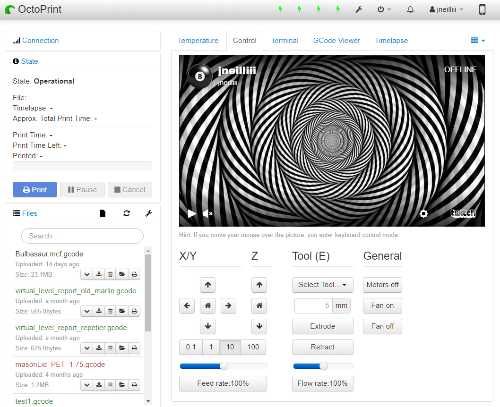

# Webcam Iframe

Simple plugin that replaces the webcam image on the control tab with an iframe that loads the webcam url from the default settings.

## Setup

Install via the bundled [Plugin Manager](https://github.com/foosel/OctoPrint/wiki/Plugin:-Plugin-Manager)
or manually using this URL:

    https://github.com/jneilliii/OctoPrint-WebcamIframe/archive/master.zip

## Configuration

Set your webcam stream url to the address of a web page to load within the iframe that replaces the default image on the control tab. For example, for a twitch url you can use something like `https://player.twitch.tv/?channel=jneilliii&muted=true`

### Setup cameras with onboard H264 video compression 

High quality, low cpu (2%) and bandwidth (3 Mbps) H264 stream with [compatible web cameras](https://en.everybodywiki.com/List_of_cameras_with_onboard_video_compression):

 - Run `cvlc --no-audio v4l2:///dev/video0 --v4l2-width 1920 --v4l2-height 1080 --v4l2-chroma h264 --v4l2-fps 30 --sout '#standard{access=http{mime=video/mp4},mux=mkv,dst=:8554/video.mp4}' -I dummy`
  - Set camera url to `http://[IP]:8544/video.mp4`

## Get Help

If you experience issues with this plugin or need assistance please use the issue tracker by clicking issues above.

### Additional Plugins

Check out my other plugins [here](https://plugins.octoprint.org/by_author/#jneilliii)

### Sponsors
- Andreas Lindermayr
- [@Mearman](https://github.com/Mearman)
- [@TxBillbr](https://github.com/TxBillbr)
- Gerald Dachs
- [@TheTuxKeeper](https://github.com/thetuxkeeper)
- @tideline3d

### Support My Efforts
I, jneilliii, programmed this plugin for fun and do my best effort to support those that have issues with it, please return the favor and leave me a tip or become a Patron if you find this plugin helpful and want me to continue future development.

 

<small>No paypal.me? Send funds via PayPal to jneilliii&#64;gmail&#46;com</small>
